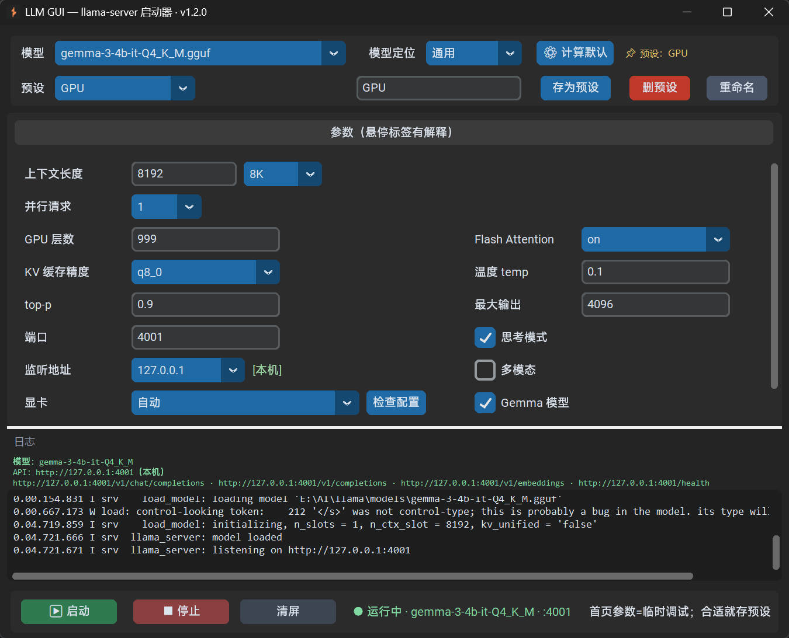

# LLM GUI

Windows 本地桌面启动器 —— 用图形界面管理 `llama-server`，启动本地大模型推理服务。

> [English](docs/en/README.md)


## 特性

- 扫描 `models/` 列出本地 GGUF 模型，一键启动 / 停止 `llama-server`
- 每模型多套预设：选模型 → 加载预设 → 启动；参数悬浮即有解释
- 上下文长度自定义 + 预设档（4K ~ 64K）；并发请求自动计算每线程上下文
- 模型定位（聊天 / 翻译 / 角色扮演 / 文学创作…）→ 按显存 + 模型大小自动计算默认参数
- 思考模式开关：推理模型（Murasaki / Qwen3 / DeepSeek 等）可一键开关思考输出（`--reasoning on/off`），默认开，作为预设参数保存
- 推理预算：限定推理模型在「思考」阶段最多花费的 token（`--reasoning-budget`），留空 = 不限
- 多模态开关：视觉模型（Qwen2.5-VL / LLaVA / MiniCPM-V 等）勾选后启动带 `--mmproj`，自动按文件名匹配 `models/` 里的 mmproj 投影文件（多个时选最匹配的），也可用「投影文件」下拉手动指定（按模型记住）；mmproj 文件本身不作为可选模型列出
- Gemma 模型选项：勾选后使用专用聊天模板并建议低温（预设参数，未指定时按文件名自动判断）
- 所有参数可留空：空字段 = 不传给 llama-server，用 llama 自身默认值
- llama-server.exe 路径为全局设置（「设置」里选择，留空用程序同目录）
- GPU 下拉（`nvidia-smi` 自动检测）；监听地址本机 / 局域网；KV 缓存精度档位
- 实时日志 + 常驻显示模型名与 API 地址（含 `/v1/chat/completions` 等端点）
- 单文件 exe，无需安装 Python

## 界面预览



## 快速开始

1. 下载 [llama.cpp](https://github.com/ggml-org/llama.cpp/releases) Windows CUDA 版，将 `llama-server.exe` 及其 DLL 放到程序同目录
2. 把 GGUF 模型放入程序同目录的 `models/` 子目录
3. 运行 `LLMGUI.exe`，或直接用 Python 运行 `python llm_gui.py`

> Gemma 模型需要 `gemma_chat_template.jinja`（已随仓库提供）。

## 使用说明

- **预设**：选好模型和参数后点「存为预设」；每个模型可有多套预设（数据存本地 `llm_presets.json`，属个人文件，不入库）。所有可设置参数都存进预设（含思考模式 / Gemma），留空 = 不传给 llama-server 用默认值
- **自动计算**：选「模型定位」后点「⚙ 计算默认」，程序按本机显存 + 模型大小算出 `ctx / ngl / temp…`（结果存本地 `llm_default_presets.json`，机器相关，不入库）
- **Gemma 模型**：勾选参数区的「Gemma 模型」复选框，启动会带 `--chat-template-file` 且自动计算采用低温度；存为预设参数，未指定时按文件名自动判断
- **思考模式**：参数区的「思考模式」默认开 → 启动带 `--reasoning on`（推理模型先思考再答，如 Murasaki 思维链 / Qwen3）；取消 → 带 `--reasoning off`（直出答案）。作为预设参数保存，预设省略时按开处理
- **推理预算**：「思考模式」正下方的「推理预算」限定思考阶段最多花费的 token（`--reasoning-budget`）。`-1`=不限 / `0`=立即结束思考 / 正数=预算；留空 = 不传（llama 默认 -1 不限）
- **多模态**：勾选参数区的「多模态」→ 启动带 `--mmproj`。投影文件默认「（自动）」按文件名匹配（单个直接用；多个时选最像的；找不到匹配会在日志提示），也可在「投影文件」下拉手动指定具体文件（按模型记住、优先于自动）。作为预设参数保存，默认关。`mmproj` 文件不作为可选模型列出
- **llama 路径**：默认用程序同目录的 `llama-server.exe`；可在「设置」里选择其他路径（全局，不在预设里）
- **API 地址**：启动后日志上方常驻显示 `http://127.0.0.1:<端口>` 与常用端点，方便接入翻译工具等

## 文件结构

| 文件 | 说明 |
|------|------|
| `llm_gui.py` | 程序源码 |
| `gemma_chat_template.jinja` | Gemma 聊天模板 |
| `presets_template.json` | 预设模板（带注释的 JSONC）。**随仓库提供，有需要的用户自行下载**；复制成 llm_presets.json 或从「设置→导入预设」合并即可用 |
| `app.ico` | 程序图标 |
| `维护文档.md` | 文件维护文档（项目结构与检索锚点，供后续维护用） |

> 发布包（Release）默认仅含 `LLMGUI.exe` 单文件；`presets_template.json` 在仓库根目录，有需要的用户自行下载。

本地运行后自动生成（个人文件，不入库）：`llm_presets.json`（预设）、`llm_default_presets.json`（自动计算参数）、`llm_gui_config.json`（本机配置）。

## 打包 exe

```bat
pyinstaller --onefile --windowed --name LLMGUI --icon=app.ico --collect-all customtkinter llm_gui.py
```

## 变更日志

- v1.6.0（2026-08-17）新增 + 修改：
  - 新增：模型下拉右侧 `⟳` 刷新按钮——强制重新扫描 `models/` 目录，增删模型即时生效；刷新期间按钮禁用防重复点击，当前选中的模型若还在列表则保持不变
  - 修改：默认端口 4000 → 8080（对齐 llama.cpp 默认）
- v1.5.0（2026-08-15）新增：
  - 新增：参数「CORS 允许源」（`--cors`）——浏览器跨域访问 API 的来源白名单，位于批处理大小下方；`*` = 允许任意来源，或写具体来源、多个用逗号分隔；留空 = 不传
- v1.4.0（2026-08-15）新增 + 修复 + 优化：
  - 新增：参数「推理预算」（`--reasoning-budget`）——限定推理模型思考阶段 token 预算，位于思考模式正下方，留空 = 不限
  - 新增：参数区「投影文件」下拉——`mmproj-F16.gguf` 这类通用名（带不出系列/尺寸）也能手动指定当前模型的投影文件，按模型记住、优先于自动匹配
  - 优化：参数区第二列整体上移对齐——Flash Attention 与上下文长度同行，右侧参数/勾选项与左侧逐行对齐
  - 修复：`mmproj-*` 前缀的多模态投影文件不再被当作独立模型（不出现在模型下拉/模型清单）
  - 修复：多个多模态模型混放时按文件名 token 重叠度自动匹配各自的 mmproj（单个直接用；都匹配不上时在日志提示，避免挂错投影）
- v1.3.0（2026-08-14）新增 + 修复：
  - 新增：设置页「📦 模型清单」——弹出窗口列出 models/ 下所有模型及大小，底部显示总占用
  - 修复：启动服务时长模型名把状态栏右侧「设置」按钮顶出窗口（状态文本自动截断模型名）
  - 删除：首页参数区的「首页参数=临时调试」调试提示
- v1.2.0（2026-08-14）综合更新（自 v1.1.4 起未发布内容一并收录）：
  - 新增：思考模式开关（默认开，`--reasoning on/off`）；多模态开关（视觉模型勾选 → `--mmproj`，自动匹配 models/ 里的投影文件）
  - 重构：思考模式 / Gemma / 多模态 均改为预设参数（存进 llm_presets.json）；**所有参数可留空** = 不传给 llama-server 用默认（下拉参数新增「（默认）」项）；llama-server 路径改为**全局设置**（移入「设置」对话框，可浏览选择）
  - 新增：`presets_template.json` 带注释预设模板；预设文件支持 JSONC 注释
- v1.1.4（2026-08-12）新增：记住上次选的模型，下次启动自动选中（模型被删则回退第一个）
- v1.1.3（2026-08-12）修复：选「（无预设）」或切到无预设模型时，输入框恢复显示模型名（不再残留上个预设名）
- v1.1.2（2026-08-12）优化：模型有可用预设时优先用预设（上次选的 >「默认」> 第一个），无预设才自动计算；点「计算默认」/改定位/勾 Gemma 可主动覆盖
- v1.1.1（2026-08-12）优化：删预设可用时颜色变鲜艳 / 悬浮提示左对齐原文下方（靠右自动右对齐）/ 弹窗应用图标并居中 / Gemma 复选框移到最大输出下 / 重命名直接用输入框文字 / 加载预设后输入框显示预设名
- v1.1.0（2026-08-12）首个发布：预设 / 按显存自动计算默认参数 / GPU 检测 / 常驻 API 地址（可选中复制）/ Gemma 模型选项（缺模板自动生成）/ 参数来源标识（⚡自动计算·📌预设·✏手动调整）/ 记住每个模型上次选的预设 / 预设重命名 / 记住窗口大小与分割线 / 设置预设健康检查（保留/删除/导出）/ 导入预设（同名可选覆盖/保留）/ 批量管理预设 / llama 进程静默启动
