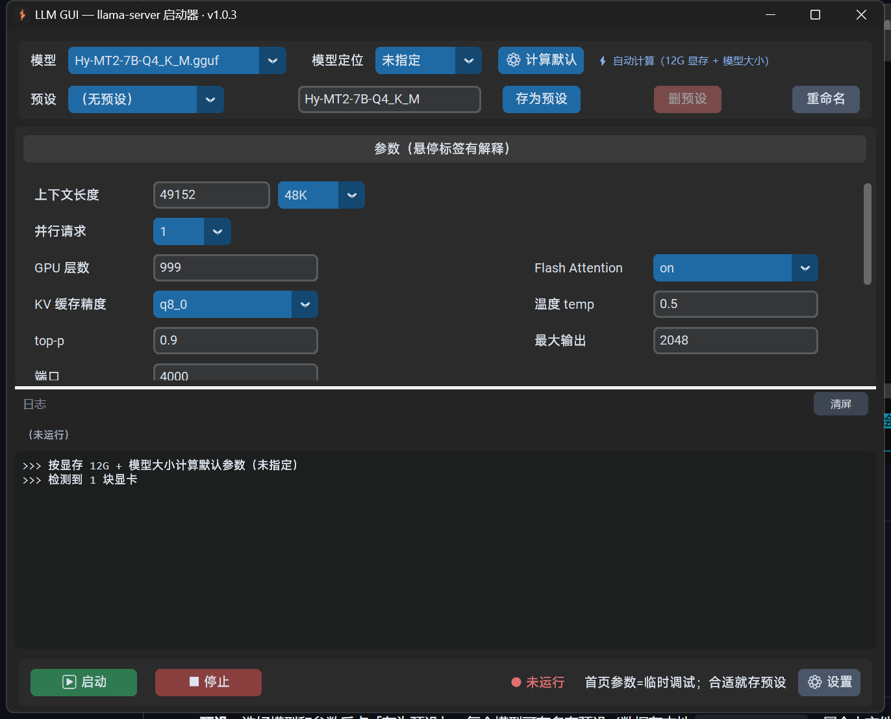

# LLM GUI

A local desktop launcher for Windows that manages `llama-server` with a GUI — start local LLM inference with point-and-click.

> [中文](../README.md)

## Features

- Scans `models/` for local GGUF models, starts / stops `llama-server` in one click
- Per-model presets: pick model → load preset → start; hover tooltips on every parameter
- Custom context length + presets (4K ~ 64K); parallel requests auto-compute per-worker context
- Model category (chat / translation / roleplay / creative writing…) → auto-computes defaults from VRAM + model size
- Gemma model option: uses the dedicated chat template and suggests a low temperature (replaces filename guessing)
- GPU dropdown (auto-detected via `nvidia-smi`); listen on localhost / LAN; KV cache precision options
- Live logs + persistent display of model name and API endpoints (e.g. `/v1/chat/completions`)
- Single-file exe, no Python installation needed

## Screenshot



## Quick Start

1. Download the Windows CUDA build of [llama.cpp](https://github.com/ggml-org/llama.cpp/releases), put `llama-server.exe` and its DLLs next to the program
2. Put GGUF models into a `models/` subdirectory next to the program
3. Run `LLMGUI.exe`, or run `python llm_gui.py`

> Gemma models need `gemma_chat_template.jinja` (bundled in this repo).

## Usage

- **Presets**: tune parameters then click "存为预设" to save; each model can have multiple presets (stored locally in `llm_presets.json`, a personal file not committed to the repo)
- **Auto-compute**: pick a "模型定位" (category) then click "⚙ 计算默认"; the program computes `ctx / ngl / temp…` from your VRAM and model size (results stored locally in `llm_default_presets.json`, machine-specific, not committed)
- **Gemma**: check the "Gemma 模型" box in the parameters area to launch with `--chat-template-file` and low-temperature auto-compute; defaults to filename detection but can be overridden per model
- **API address**: after startup, the model name and `http://127.0.0.1:<port>` endpoints are shown persistently above the log

## Files

| File | Description |
|------|-------------|
| `llm_gui.py` | Program source |
| `gemma_chat_template.jinja` | Chat template for Gemma models |
| `app.ico` | Program icon |

Files auto-generated locally at runtime (personal, not committed): `llm_presets.json` (presets), `llm_default_presets.json` (auto-computed params), `llm_gui_config.json` (local config).

## Build the exe

```bat
pyinstaller --onefile --windowed --name LLMGUI --icon=app.ico --collect-all customtkinter llm_gui.py
```

## Version

- v1.0.3 (2026-08-12) Fix: remembered window size no longer grows on repeated open/close (logical size + screen cap)
- v1.0.2 (2026-08-12) Rename presets / remember window size
- v1.0.1 (2026-08-12) Parameter source marker (auto-computed / preset / manual) / remember last selected preset per model
- v1.0.0 (2026-08-12) Initial release: presets / auto-compute / GPU detection / persistent API address / Gemma option / version & About
